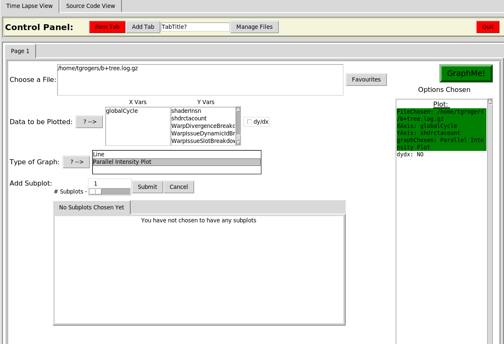
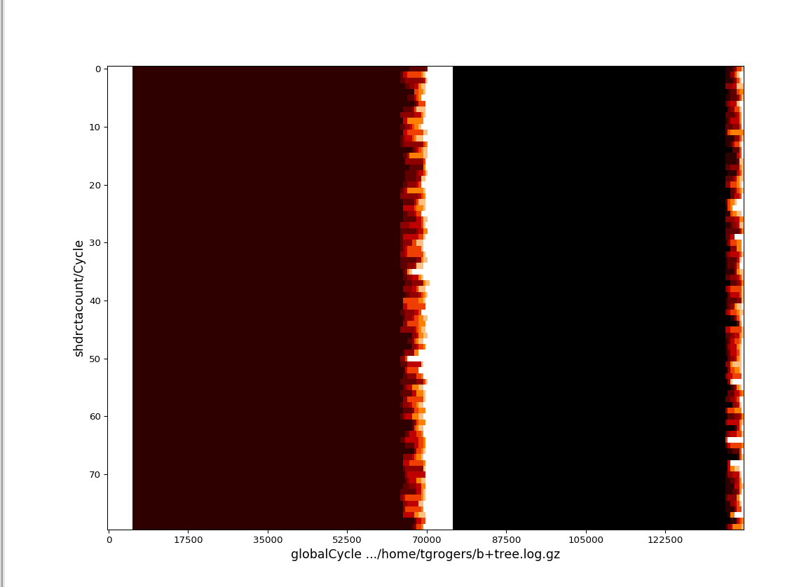

# GPU Simulation Assignment Part #2

## Changing the CTA-level scheduler.

In this assignment, you will make modifications to the threadblock scheduler.
By default, as we discussed in class, the scheduler will attempt to involve as many
SMs and SM clusters as possible - round-robin between clusters and SMs within clusters
before assigning more than one threadblock to a core. In this assignment, you will make modifications
to this scheduler and analyze the results. Note that in the Volta configuration provided
assumes that each SM gets its own interconnect port (i.e. the SM concentration level is effectively 1).

### Collecting baseline statistics

Before making any changes to the code, gather statistics on high-level metrics for
each application. In particular IPC, L1 misses, and L2 misses.
Also use Arielvision to create a plot of CTAs/core versus time.

To run arielvision, use ./gpu-simulator/gpgpu-sim/bin/aerialvision.py
You will need to give it the log.gz file that was output from the benchmark you want to plot.
These files can be found in the *./sim\_run\_9.1/* folder, for example:

```
./sim_run_9.1/lud-rodinia-3.1/_s_256__v/QV100-SASS-1B_INSN-VISUAL/gpgpusim_visualizer__Mon-Apr-19-12-00-54-2021.log.gz
```

When run with the *-VISUAL* flag, the simulator will continuously add to this file (so you can acutally use partial results)
and once its done you will have the output for the entire application.

Once you have the file, an example of how to setup the CTAs versus time is shown below.
Remember, you will need to run arielvision on a linus machine where you have x-server running (you can use x11 forwarding for example).



You do not have to do this for every application, for this part, just do it for the LUD application and
one other application of your choice.
You will need to use these again to demonstrate that your code changes actually worked.
An example CTA/shader plot (for b+tree) is as follows:



The x-axis is time in cycles, each number on the y-axis represents one SM and the color of the time line indicates
how many CTAs are assigned to the SM at this time. Darker colors = more CTAs assigned to the core.
As time progresses, CTAs complete and the color of each SM gets lighter.

For these experiments use the SASS-based V100 model we used in part 1 and make sure to use
the same environment setup commands we used in Part 1.

### Changing the default interconnect concentration

In the simulator there is a configuration parameter: *gpgpu\_n\_cores\_per\_cluster*.
In the QV100 config, this is 1 by default. Modify file

```
./util/job_launching/configs/define-standard-cfgs.yml
```

To add an 8CLUSTER config add on that modifies sets the *gpgpu\_n\_cores\_per\_cluster* to 8.

Re-run the experiments using this configuration.
Collect the CTA/shared vs time for the 2 apps you used previously, and the relative IPC, L1 and L2 misses for all the apps.

### Changing the CTA-level scheduler

In this part of the project, you will change the simulator code.
In particular, you will change the way CTAs are assigned to SMs.
The baseline algorithm is found here:

https://github.com/tgrogers/accel-sim-framework/blob/3b180d3d9b2bfe5def6b3e9025b9f51585ebee2a/gpu-simulator/gpgpu-sim/src/gpgpu-sim/gpu-sim.cc#L1725

You are to implement 2 different algorithms and collect the IPC, L1 hits and L2 hits (relative the the baseline) for all the apps in
ece695.part2.

1. **Completely flat scheduler:**
    Make the scheduler unaware of the clusters, i.e. you can start filling up SMs in the same cluster before you move on to the next cluster.
    Collect the CTA/shared vs time for the 2 apps you used previously, and the relative IPC, L1 and L2 misses for all the apps.

1. **Greedy CTA Scheduler:**
    Make the scheduler pack one SM fully (as much as the occupancy calculation allows) before moving on to the next SM.
    Collect the CTA/shared vs time for the 2 apps you used previously, and the relative IPC, L1 and L2 misses for all the apps.

## What to hand in.

Submit a 3-page max pdf (call this part2.report.pdf and commit it in the assignment repo).

You must have 3 plots for CTA/SM vs time for: Baseline, 8Cluster, FlatScheduler, Greedy Scheduler

You must also have 3 bar charts: one for each of the relative IPC, L1 misses, and L2 misses that compare Baseline, 8Cluster, FlatScheduler, and Geedy Scheduler.

Please write at least a paragraph on each statistic that summarizes the results and suggests reasons for why they look the way they do.
