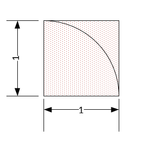

# ECE 695 CUDA Programming Part 1

## Professor Tim Rogers <br> TA: Abhishek Bhaumick

## Due on Feb 6
## Introduction

The purpose of this lab is to familiarize yourself with CUDA programming and the fundamental methodology for parallelizing a traditional CPU-based algorithm for GPU acceleration.  

The official [CUDA Documentation](https://docs.nvidia.com/cuda/) is the best resource for  implementation details and API specifics. You will find yourself referring back to various sections of this page over the next few weeks as we delve deeper into the CUDA API and the architecture of a GP-GPU. 

-----------------------------------------------------------
<br>

## PART A: Single-precision A · X Plus Y (SAXPY)

SAXPY stands for `Single-Precision A·X Plus Y`.  It is a function in the standard [Basic Linear Algebra Subroutines (BLAS)](http://en.wikipedia.org/wiki/Basic_Linear_Algebra_Subprograms) library. SAXPY is a combination of scalar multiplication and vector addition, and it’s very simple: it takes as input two vectors of 32-bit floats X and Y with N elements each, and a scalar value A. It multiplies each element `X[i]` by `A` (Scale) and adds the result to `Y[i]`.


### CPU Implementation

An simple CPU-based implementation for `saxpy` can be found in `saxpy_cpu.c` in your Lab1 starter code. The saxpy routines iterates through scales the elements of the vector `x` by `scale` and accumulates the value into the vector `y`. Thus, the original values of `y` prior to saxpy are overwritten. It might help to backup the original vector `y` to make verifying your own application easier.


```C++
void saxpy_cpu(float* x, float* y, float scale, size_t size) {
    for (int idx = 0; idx < size; ++idx) {
        y[idx] = scale * x[idx] + y[idx];
    }
}
```
### GPU Implementation

SAXPY is an [embarrassing parallel](https://en.wikipedia.org/wiki/Embarrassingly_parallel) workload where the computation of each element in the vector is completely independent of all other elements. To parallelize SAXPY for the GPU, we will use the x dimension (recall thread organization from the lectures) such that each thread will (execute the saxpy computation to) generate a single member of the output vector. 

The host portion of the saxpy code can be written inside `runGpuSaxpy()` inside `cudaLib.cu`. The device code must be written inside the kernel `saxpy_gpu()`. Some hints about the required functions prototypes are present in the starter code. 

**Follow the function interfaces strictly to ensure you code is compatible with the grader application and can be graded without a hitch.**

**NOTE**: The GPU kernels WILL be tested using a wide variety of inputs both in terms of actual values and the dimensions of the vectors. Make sure you test your code thoroughly with a diverse set of inputs before turning it in.

### Required Background

A understanding of the following functions will be crucial to proper execution of this portion of the assignment.

```C++
cudaMalloc();
cudaMemcpy();
cudaFree();
```
Furthermore, the elements of each vector can be generated using the `rand()` function. However, you might find it easier to test/debug your code with a simpler pattern of your choice.

### Expected Behavior

The following behavior is expected from  `int runGpuSaxpy(int vectorSize)` 

- generate two random floating point vectors `x` and `y` of `vectorSize` each
- use a GPU kernel to perform `Y += aX` 
    - a is a random floating point scaling factor
- verify the kernel using CPU code
    - you may use the functions already provided in `cpuLib` library


-----------------------------------------------------------
<br>

## PART B: Monte Carlo estimation of the value of _&pi;_

Monte Carlo methods are a broad class of computational algorithms that rely on repeated random sampling to obtain numerical results. [[1]](#1)
Among a wide variety of applications, this method can be utilized to estimate the value of _&pi;_ as described below.

<span style="display:block;text-align:center">\
    
</span>


### Estimating _&pi;_

We will be exploiting the relation between the area of a unit square and the quarter of a unit circle. 

- Area of a quarter circle  = _&pi; r <sup>2</sup> / 4_     = _&pi; / 4_
- Area of a unit square     = s <sup>2</sup>                = 1

We can generate random points all over the area of a unit square and calculate the probability of any such point lying within the unit circle (distance from origin < 1). With a large enough set of points, we will be able to somewhat accurately estimate the value of _&pi;_ to a few decimal points.

The basic algorithm can be seen in `cpuLib.cpp::runCpuMCPi()` 
- A large number of random points are generated in the 2D space with `x`, `y` &in; `[0,1)`
- The distance of each point from the origin is calculated as (x*x + y*y)<sup>0.5</sup>
- If the point falls within the unit quadrant, it is a `hit`
- The probability of a `hit` is approximately equal to &pi;/4


### CPU Implementation

A CPU-only implementation of the algorithm can be found in `cpuLib.cpp::runCpuMCPi()` which follows the basic steps stated above. The arithmetic portion of determining if a point lies between the unit circle quadrant is shown below.

```c++
		//	Main CPU Monte-Carlo Code
		for (size_t idx = 0; idx < MC_SAMPLE_SIZE; ++idx) {
			x = rand();
			y = rand();
			
			if ( int(x * x + y * y) == 0 ) {
				++ hitCount;
			}
		}
```

### Generating random points

The standard C/C++ `rand()` function [[2]](https://en.cppreference.com/w/c/numeric/random/rand) [[3]](https://en.cppreference.com/w/cpp/numeric/random/rand) can be used to generate random integral values between `0` and `RAND_MAX`. 

For simplicity, we will treat both the x and y coordinates of a point as uniform random variables but use the same generator for to generate both x and y coordinates.

The starter code uses the `rand()` and `srand()` pair in CPU SAXPY. A more `"proper"` and `C++11` way of generating random numbers using the C++11 `random` library is used in CPU Monte-Carlo. For the curious we have used the `std::random_device` - a uniformly-distributed integer random number generator and the `std::mt19937` - a [Mersenne Twister](https://en.wikipedia.org/wiki/Mersenne_Twister) pseudo-random generator of 32-bit numbers with a state size of 19937 bits.


### GPU Implementation

The CUDA kernel needs to written such that each GPU thread will process a predefined (constant) number of random points on the x-y plane. The task of identifying an appropriate way of parallelizing the workload is left to you.

Following the CPU implementation, a simple approach would be to generate a large set of random points on the CPU and then using the GPU to figure out whether a point lies within the unit circle. However, for a large set of points (~ 10 <sup>6</sup>) or larger, this will result in a huge data transfers over the (relatively) slow PCIe interface. You are encouraged to try building this application to observe the same effect mentioned above.

A better approach is to utilize the [cuRand](https://docs.nvidia.com/cuda/pdf/CURAND_Library.pdf) library.

An simple way of generating a set of uniform random numbers using the `cuRAND` library is shown below. Refer to the [cuRAND documentation](https://docs.nvidia.com/cuda/curand/introduction.html) for information like the range of values generated etc.

```C++
	// Setup RNG
	curandState_t rng;
	curand_init(clock64(), threadId, 0, &rng);

    // Get a new random value
    int randInt = curand_uniform(&rng);
```

A skeleton is already present in the starter code that can be built upon to complete this portion of the assignment. Like Part A, place your host code in `cudaLib.cu::runGpuMCPi()` and the place your device kernel device in `cudaLib.cu`

### OPTIONAL

While running a large Monte-Carlo simulation (>> 1 bn values) you will end up running a large number of threads each of which will generate a count of points within the unit circle. Since this set of `partial-counts` itself might be (>> 1000 values), you might find it useful to write an additional `reduce` kernel to further reduce the set by summing up portions of this set inside the GPU. This will result in a more tractable size of `partial-counts` that can then be summed up in the CPU to arrive at the final probability. This kernel's behavior will be similar to the `Reduce` portion of [Map-Reduce](https://en.wikipedia.org/wiki/MapReduce).


# Building and Executing the Project

## Preparing your System

All students will have access to GPU resources through gpu.scholar.rcac.purdue.edu.
You should be able to use your Purdue Career Accounts to
ssh into gpu.scholar.rcac.purdue.edu and access a GPU there. You are also free to use your own GPU if you have access to one.
Contact the instructors on Piazza for any trouble regarding access to the same.

### Check for GPU & Drivers
The default setup of the machines available for the class has all the software you need to build and test your project. Ensure that the cuda driver is installed and working with the below command.

```bash
$ nvidia-smi
+-----------------------------------------------------------------------------+
| NVIDIA-SMI 440.33.01    Driver Version: 440.33.01    CUDA Version: 10.2     |
|-------------------------------+----------------------+----------------------+
| GPU  Name        Persistence-M| Bus-Id        Disp.A | Volatile Uncorr. ECC |
| Fan  Temp  Perf  Pwr:Usage/Cap|         Memory-Usage | GPU-Util  Compute M. |
|===============================+======================+======================|
|   0  Tesla V100-PCIE...  Off  | 00000000:D8:00.0 Off |                    0 |
| N/A   35C    P0    37W / 250W |      0MiB / 16160MiB |      0%      Default |
+-------------------------------+----------------------+----------------------+

+-----------------------------------------------------------------------------+
| Processes:                                                       GPU Memory |
|  GPU       PID   Type   Process name                             Usage      |
|=============================================================================|
|  No running processes found                                                 |
+-----------------------------------------------------------------------------+
```
This command can also be used to identify any stray kernels you might have running in the background and kill the corresponding process.

### Setup Environment

Before you start writing and building code, the appropriate development toolkits must be loaded. 
`This process MUST be repeated every time you login and in every new terminal instance`. We will load the gcc, CUDA and CMake modules to help us with building and executing our application(s).

```bash
module load gcc cuda cmake
```

## Project Organization

The project is structured following a standard template to allow easy scalability as well as to facilitate easy verification of your submissions. `Follow the below guidelines strictly.`

- Each lab will have a `main()` file which is the single entry-point and the only executable. For this lab, it is `lab1.cu`
- The main file will contain a simple interactive shell to allow you to launch routines that are part of the lab. An example of Lab 1's output is shown below. 
- The main file will utilize libraries that will be divided into header (`/include`) and source (`/src`) files. A skeleton has been provided in Lab 1 to get you started.
- The majority of the code you will write will be in the `/src` directory but ensure that the header file is updated.
- All `CUDA` related code must go within a `.cu` file - this includes ALL `device` code and any `host` code that uses any portions of the CUDA API.
- `CPU-only` portions of the code can be placed within a `.cpp` file - which will be compiled by the `gcc`/`g++` compiler instead of `nvcc`.

### Building an Application

The assignments use [CMake](https://cmake.org/) build system. Since it has a steep learning curve, the necessary `CMakeLists.txt` files have been provided with the starter code. 

- `cmake .` (notice the DOT) is used to update the `Makefiles` 
- `make` is then used to build the application(s)
- `make clean` can be used to cleanup the prebuilt binaries and libraries.

The shell commands required to build are listed below along with an expected output.

```bash
 $ cmake .
-- CMake version: 3.15.4
-- USE_CUDA: ON
-- Configuring done
-- Generating done
-- Build files have been written to: /home/...../lab1

```

```bash
 $ make
-- CMake version: 3.15.4
-- USE_CUDA: ON
-- Configuring done
-- Generating done
-- Build files have been written to: /home/....../lab1
[ 16%] Building NVCC (Device) object src/CMakeFiles/cudaLib.dir/cudaLib_generated_cudaLib.cu.o
[ 33%] Linking CXX static library libcudaLib.a
[ 33%] Built target cudaLib
[ 50%] Building CXX object src/CMakeFiles/cpuLib.dir/cpuLib.cpp.o
[ 66%] Linking CXX static library libcpuLib.a
[ 66%] Built target cpuLib
[ 83%] Building CUDA object CMakeFiles/lab1.dir/lab1.cu.o
[100%] Linking CXX executable lab1
[100%] Built target lab1
```


### Launching an Application

```bash
$ ./lab1
ECE 695 - Lab 1 
Select application: 
  1 - CPU SAXPY 
  2 - GPU SAXPY 
  3 - CPU Monte-Carlo Pi 
  4 - GPU Monte-Carlo Pi 
>
```

Selecting the appropriate option will result in execution of the corresponding application.

-------------------------------------

<br>

## Report


### Profiling a CUDA Application

The CUDA SDK comes with a built in profiler `nvprof` [[3]](#3). 

    The nvprof profiling tool enables you to collect and view profiling data from the command-line. nvprof enables the collection of a timeline of CUDA-related activities on both CPU and GPU, including kernel execution, memory transfers, memory set and CUDA API calls and events or metrics for CUDA kernels. Profiling options are provided to nvprof through command-line options. Profiling results are displayed in the console after the profiling data is collected, and may also be saved for later viewing

Profiling a pre-built application using the profiler is as simple as launching nvprof with the application path as argument.

```bash
$ nvprof ./lab1
```

The profiler presents an interactive console which allows you to execute the application as usual and on application termination, provides a categorized table with values like below.

```bash
           Type  Time(%)      Time     Calls       Avg       Min       Max  Name
 GPU activities:  
 
      API calls:   
```

Refer the profiling section of [CUDA Toolkit Documentation](https://docs.nvidia.com/cuda/profiler-users-guide/index.html#nvprof-overview) for more details about the nvprof tool.

The nvprof output can be used to quantitatively measure the execution time of a CUDA application with a breakdown on the time spent in each kernel or API call. The profiler presents a wealth of information. It is imperative that you become familiar with utilizing the profiler information to measure code performance and the impact of optimization steps / changes in future labs.

### Reporting Profiler Output

We expect you to present the information gleaned from profiling your application in the form of a stacked bar chart with which shows the execution time for varying input sizes with a breakdown of each API-Call or Kernel that takes up a major portion of the execution time. (see `time %` column of nvprof output).

- Illustrate the relation of execution time with each parameter you have varied and tested
    - eg vectorSize for Part A
- Illustrate the breakup of execution time in terms of the major time-consumers as reported by `nvprof`
    - eg Suppose you have tested SAXPY for a set of vector sizes = _V_
    - for each v &in; _V_
        - place a bar showing the breakup of execution time in terms the top time-consumers reported by `nvprof`
- Make sure to label your graph axes and categories correctly.


Report any observations you have from profiling the code you have written as well as by interpreting the above graph. Try to keep you report within a couple of pages.


## References
<a id="1">[1]</a> 
[Wikipedia - Monte-Carlo Method](https://en.wikipedia.org/wiki/Monte_Carlo_method)

<a id="cppref">[2]</a>
[cppreference](https://en.cppreference.com)

<a id="nvprof">[3]</a>
[CUDA Profiler User Guide](https://docs.nvidia.com/cuda/pdf/CUDA_Profiler_Users_Guide.pdf)
