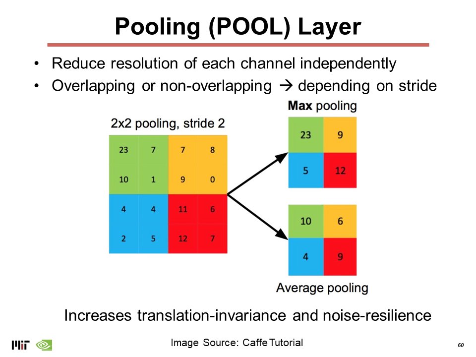
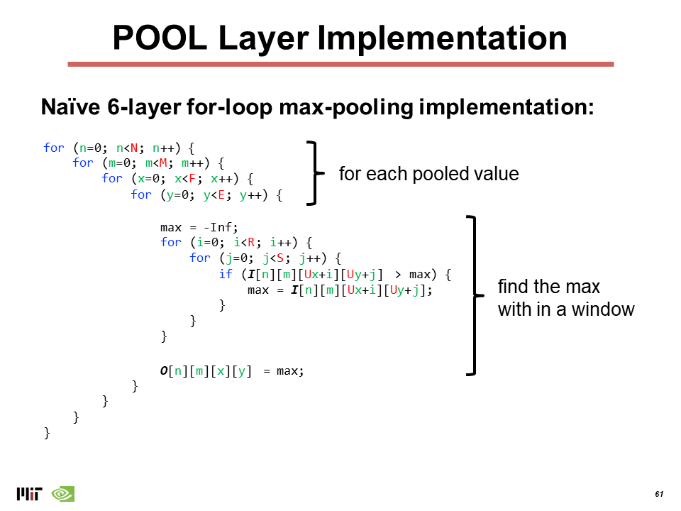
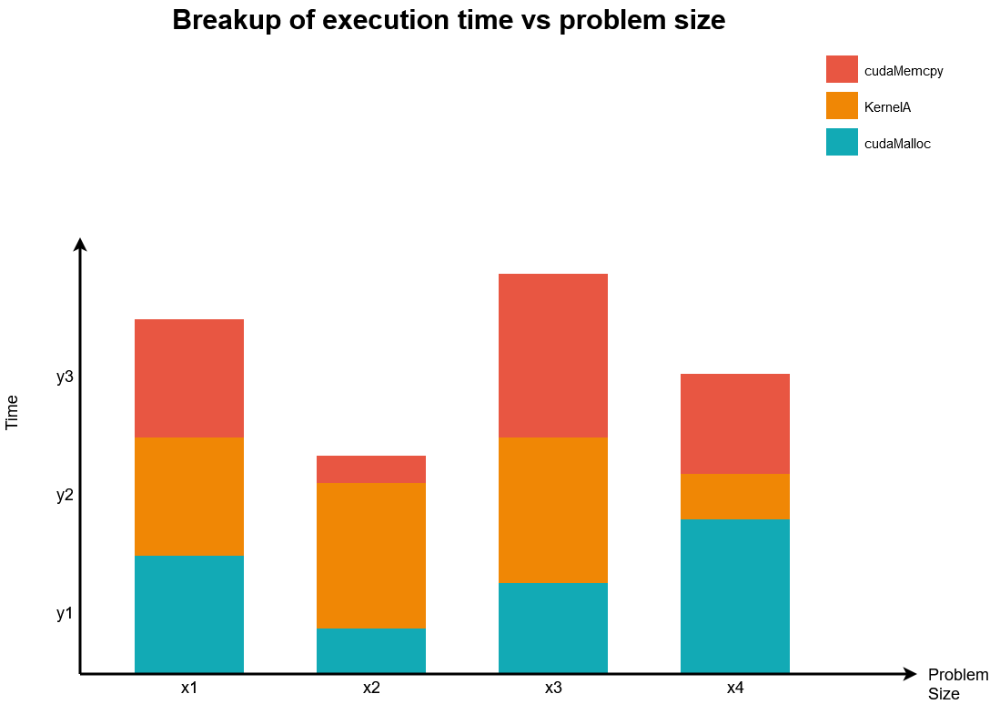

# ECE 695 CUDA Programming Part 2

## Professor Tim Rogers <br> TA: Abhishek Bhaumick

## Due on March 7, 2021
# Introduction


The first assignment exploited data parallelism along a single dimension - with a direct one-to-one or one-to-many correlation between each thread and the data it processes.
In the second assignment we will be operating on 2-D data and look at ways to adapt some common operations for the GPU.

The official [CUDA Documentation](https://docs.nvidia.com/cuda/) is the best resource for  implementation details and API specifics. The [NVIDIA Developer Blog](https://developer.nvidia.com/blog) has a number of guides which showcase the latest and best CUDA programming practices.

> We would strongly recommend reading through the CUDA related links within this document before you start writing code.

This lab is a significant departure from the previous lab. There are a number of unique ways to parallelize each task and each choice comes with its own set of tradeoffs. There is a significant set of possible implementations and _we cannot wait to see your `ingeneous` and `unique` take on the problems._

> To boldly go where no one has gone before!
>
> -- <cite>Captain James T. Kirk, USS Enterprise</cite>

-----------------------------------------------------------
<br>

# PART A: Filtering Noise from Images
## Median Filtering

The [median filter](https://en.wikipedia.org/wiki/Median_filter) is a non-linear digital filtering technique, often used to remove noise from an image or signal [[1]](#1). For small to moderate levels of Gaussian noise, the median filter is demonstrably better than Gaussian blur at removing noise whilst preserving edges for a given, fixed window size. [[2]](#2).

While a number of efficient implementations of median filtering exists [[3]](#3), we will be using the relatively compute-intensive "simple" implementation, that precisely computes the median. Furthermore, to simplify the implementation, we will be using a cental symmetric rectangular / square window such that the pixel at the centre will be replaced by the median of all the pixels in

A simple description of the algorithm can be found [here](http://fourier.eng.hmc.edu/e161/lectures/smooth_sharpen/node2.html). The curious, interested in exploring Median Filtering in the context of recent (and past) academic work can visit [this](https://www.sciencedirect.com/topics/computer-science/median-filter).


## Implementation

The principle of the median filter is to replace the gray level of each pixel by the median of the gray levels in a neighborhood of the pixels, instead of using the average operation.
A simplified pseudo-code implementation of the median filtering algorithm is shown below.

```plaintext
for each pixel:
	load filter window - filterH x filterW centred @ pixel 
	sort the window
	store median value as output
```

A naive CPU implementation of the same can be found at `medianFilter_cpu()` in `cpuLib.cpp`. You must implement an efficient algorithm for GPU.
> Think carefully about which loops to parallelize and which to execute sequentially inside the GPU kernel.

Make sure you handle the edges of the image where the filter window may expand beyond the dimensions of the image. 
> - Try to solve this at the algorithmic level instead of padding the image
> - As an optional exercise you can try to pad the image at CPU or GPU and report the overall performance impact of this additional step.
> - You may implement this in the `medianFilter_cpu()` **prior** to starting on your `medianFilter_gpu()`.


### Steps

1. Complete the CPU implementation
	- verify visually using the `viewImageBytes.py` script.
1. Write `runGpuMedianFilter()` as entrypoint function.
1. Write the kernel `medianFilter_gpu()`
1. Write the kernel `sort_gpu()` to sort the filter window
	- Choose the sorting algorithm of **your choice**.
	- Carefully weigh (_or better yet, measure_ - **optional**) 
		- the effects of a sequential vs recursive implementation (if applicable) 
		- and their effects on the SIMT stack.

## Optimizing the Kernels

- This assignment is tightly coupled with the course material - utilize your understanding of the GPU architecture and the memory heirarchy to squeeze out the best performance for your kernel. 
- Repeated profiling with `nvprof` will help you compare the design options and evaluate the impact of your choices. 
- **Think deeply** and explore the design space in the following aspects
	- _Careful_ and _Optimal_ usage of [shared memory](https://developer.nvidia.com/blog/using-shared-memory-cuda-cc/) resources [[8]](#8)
	- Leveraging CPU-to-GPU [data transfer](https://developer.nvidia.com/blog/how-optimize-data-transfers-cuda-cc/) and GPU memory [access and coalescing patterns](https://developer.nvidia.com/blog/how-access-global-memory-efficiently-cuda-c-kernels/) [[6]](#6) [[7]](#7)
	- Threadblock and grid assignment to shaders 
		- and how that influences the working set in each cache
	- the data storage format and access patterns 
		- to help select which loops to parallelize


> Insufficient facts always invites danger, Captain.
>
> -- <cite> Cdr. Spock, USS Enterprise </cite>


## Setting Up a Python Virtual Environment

Use the following commands to setup and use a python virtual environment. This step is essential to install python packages on scholar without modifying the built-in Python copy.

```bash
# Create a new python virtual environment in local directory `./python`
$ python3 -m venv ./python

# Activate your python virtual environment
# **NOTE** This step must be repeated every time to select your venv as default python distribution
$ source ./python/bin/activate
# This step selects your "local" python environment for use instead of the system python installation

# Verify python path
$ which python3
/home/ ... /lab2/python/bin/python3

# Install required python packages
pip3 install numpy pillow

# Learn about the command line arguments
$ python3 makeBytesImage.py --help

info: No GUI element found - disabling GUI

usage: makeBytesImage.py [-h] [-f FILE] [-l LEVEL] [-r RATIO]

Prepare Image for CUDA Programming Lab 2

optional arguments:
  -h, --help  show this help message and exit
  -f FILE     input image file path
  -l LEVEL    added noise intensity
  -r RATIO    Salt vs Pepper Ratio

  # Run script 
$ python makeBytesImage.py -f ./resources/lena512color.tiff

 info: No GUI element found - disabling GUI 

TIFF 512x512 RGB
(512, 512, 3)
Storing bytes to - /......./resources/lena512color.tiff.bytes
786448 bytes written
 ... Done ! 

```

## Using the `.bytes` file format 

Modern images are stored in compressed formats like `JPEG` which have their own storage formats and compression/decompression schemes. A `custom RAW Pixel` format (`.bytes`) has been defined for the purpose of this class to enable you to quickly convert any image into the RGB pixels and use it with the code developed as part of this assignment. The required Python scripts for interconversion and viewing the original and processed images have been provided.

- `makeBytesImage.py` can be used to convert any given image (tested with `.jpg` and `.tiff` formats) into a `.bytes` file.
- `viewBytesImage.py` can be used in a GUI-enabled environment to view the contents of a `.bytes` image. 

For details about the command line arguments that can be passed to each script use 
```bash
$ python3 makeBytesImage.py --help
# or
$ python3 viewBytesImage.py --help
```


> **NOTE** : Viewing the images through any of this scripts will require you to run the scripts on a GUI enabled workspace (ThinClient or your local machines). 
> 
> - The scripts still work on console-only workspaces but will have the GIUs disabled.
> - In non-GUI environments, `makeBytesImage.py` will take console arguments and directly store the output into a `.bytes` file.


```C++
// .bytes metadata
typedef struct ImageDim_t
{
	uint32_t height;
	uint32_t width;
	uint32_t channels;
	uint32_t pixelSize;
} ImageDim;
```

The bytes format packs any image in a raw 8-bit pixel format comprised of a 16 byte metadata followed by RGB inteleaved data in [little-endian](https://chortle.ccsu.edu/AssemblyTutorial/Chapter-15/ass15_3.html) format . [[5]](https://en.wikipedia.org/wiki/Endianness)
- For the purpose of this assignment, `all images will have 3 channels and 8-bit (1-Byte) pixels`.
- The first 16 bytes of any .bytes file will have the metadata required to interpret the contents of the rest of the file (can be used to calculate dimensions and sizes)
- The remaining bytes in the file will have RGB pixels interleaved.
- Pixels are stored in Row-Major format.

Look at the contents of `loadImageBytes()` in `cpuLib.cpp` to get an idea of storage format.

|  MetaData  | Px (0,0) | Px (0,1) |  ...  | Px (0,N-1) | Px (1,0) |  ...  | Px (N-1,N-1) |
|------------| -------- | ---------|-------|------------|----------|-------|--------------|
|            | R G B    | R G B    | R G B | R G B      | R G B    | R G B | R G B        |
|  16 bytes  | 3 bytes  | 3 bytes  |       | 3 bytes    | 3 bytes  |       | 3 bytes      |


<br>

# PART B: Pooling 

A quick overview of the pooling operation in Neural Networks can be found [here](https://d2l.ai/chapter_convolutional-neural-networks/pooling.html). Read carefully to understand the operation of a pooling layer and its various configuration parameters.


> Pooling is a feature commonly imbibed into Convolutional Neural Network (CNN) architectures. The main idea behind a pooling layer is to “accumulate” features from maps generated by convolving a filter over an image. 
> 
> Formally, its function is to progressively reduce the spatial size of the representation to reduce the amount of parameters and computation in the network. The most common form of pooling is max pooling.
>
> Max pooling is done, in part, to help over-fitting by providing an abstracted form of the representation. As well, it reduces the computational cost by reducing the number of parameters to learn and provides basic translation invariance to the internal representation. Max pooling is done by applying a max filter to (usually) non-overlapping subregions of the initial representation. [[10]](#10)

> The next two labs will introduce a deep neural network in its entirety and provide you the opportunity to implement a foundational work on DNNs which has been cited > 76k times! -- `AlexNet` (http://www.cs.toronto.edu/~kriz/imagenet_classification_with_deep_convolutional.pdf).
> For this part, however, you are only required to implement the pooling layer in isolation.

An illustration of the pool operation can be found below

<span style="display:block;text-align:center">\
    
</span>


## CPU Implementation

A basic **incomplete** implementaton of a Max-Pool layer is provided inside `cpuLib.h`. It lays down the API and (after completion) can be used for checking your GPU implementation later.

1. Complete the CPU code for max pooling
1. Add provisions for padding and strides
	- implement padding by using conditional statements rather than by actually padding the data.

<span style="display:block;text-align:center">\
    
</span>

## GPU Implementation

The naive CPU implementation is a set of nested loops - each loop presents an oppornity for parallelization. Choose wisely.


<span style="display:block;text-align:center">\
    
</span>


<br>


# Reporting your Progress

> Refer to the Lab1 Readme, esp. sections on [Building and Executing the Project](https://github.com/tgrogers/ece695-2021/blob/master/cuda-programming-assignment/cuda-part1.md#building-and-executing-the-project)
 and [Reporting your Progress](https://github.com/tgrogers/ece695-2021/blob/master/cuda-programming-assignment/cuda-part1.md#report) to build, test and profile your application.

> All the instructions provided in Lab 1 also apply to this Lab

**Each time you login**
- Load the `gcc`, `cuda` and `cmake` modules
	To avoid typing this every time, consider adding this command to `~/.bashrc`.
    ```bash
    $ module load gcc cuda cmake
    ```
	.
- Activate the python virtual environment setup within the assignment directory
    ```bash
    $ cd <LAB2_ROOT_DIR>
    $ source ./python/bin/activate
    > (python) user@scholar-fe05:~/...../lab2 $
    ```
    Succesful loading of the venv will be indicated by `(python)` in front of the shell prompt as shown in the last line above

## Performance and Speedup

> Time is the only true measure of performance

Please report all metrics and speedups in terms of absolute execution time ( in _&mu;s_ or _ms_ as applicable). _Percentage doesn not convey the actual execution time._

> If you happen to use Unified Virtual Memory (`cudaMallocManaged`) report seperate sets of data for managed and unmanaged device memory.

An example of the `stacked bar chart` format expected for reporting the breakup of workload execution time for the report is given below. _Figure is indicative of format and has no correlation with any profiling graph real or fictional._


<span style="display:block;text-align:center">\
    
</span>

### Graphs

Here are some ideas for the graphs that you can use to present your efforts and results in the report.
1. Stacked bar chart (as in figure) showing execution **time** vs problem size
1. line or bar chart showing speedup vs naive cpu
1. chart showing speedup vs optimized cpu (if you make any changes)
1. chart with performance vs shared memory strategy (size or organization) - same or varying problem size
1. chart with performance gain acheived by any tenchiques you have applied

Be terse and lucid with explanations of your observations from the trends you observe.


<br> 

-------
## References

<a id="1">[1]</a> 
[Wikipedia - Median Filtering](https://en.wikipedia.org/wiki/Median_filter)

<a id="2">[2]</a> 
Arias-Castro, Ery; Donoho, David L. Does median filtering truly preserve edges better than linear filtering?. Ann. Statist. 37 (2009), no. 3, 1172--1206. doi:10.1214/08-AOS604. https://projecteuclid.org/euclid.aos/1239369019

<a id="3">[3]</a> 
T. Huang, G. Yang and G. Tang, "A fast two-dimensional median filtering algorithm," in IEEE Transactions on Acoustics, Speech, and Signal Processing, vol. 27, no. 1, pp. 13-18, February 1979, doi: 10.1109/TASSP.1979.1163188. https://ieeexplore.ieee.org/document/1163188

<a id="4">[4]</a> 
Arce, G.R. (2004). Weighted Median Filters. In Nonlinear Signal Processing, G.R. Arce (Ed.). https://doi-org.ezproxy.lib.purdue.edu/10.1002/0471691852.ch6

<a id="5">[5]</a> 
[Wikipedia - Endianness](https://en.wikipedia.org/wiki/Endianness)


[NVIDIA Developer Blog](https://developer.nvidia.com/blog)  
<a id="6">[6]</a> 
	https://developer.nvidia.com/blog/how-optimize-data-transfers-cuda-cc/  
<a id="7">[7]</a>
	https://developer.nvidia.com/blog/how-access-global-memory-efficiently-cuda-c-kernels/  
<a id="8">[8]</a>
	https://developer.nvidia.com/blog/using-shared-memory-cuda-cc/


<a id="10">[10]</a> 
[DeepAI Max-Pooling](https://deepai.org/machine-learning-glossary-and-terms/max-pooling)


