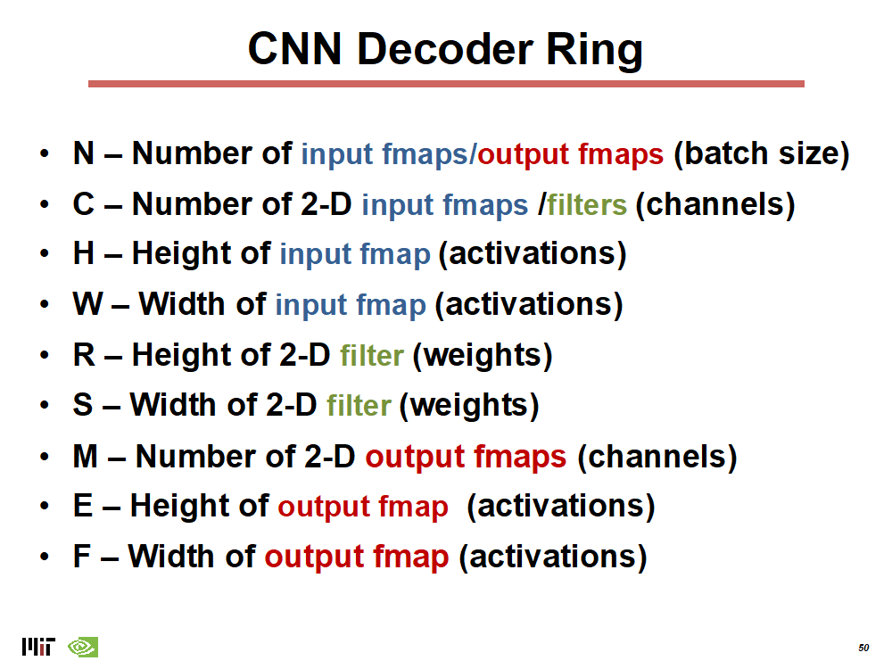
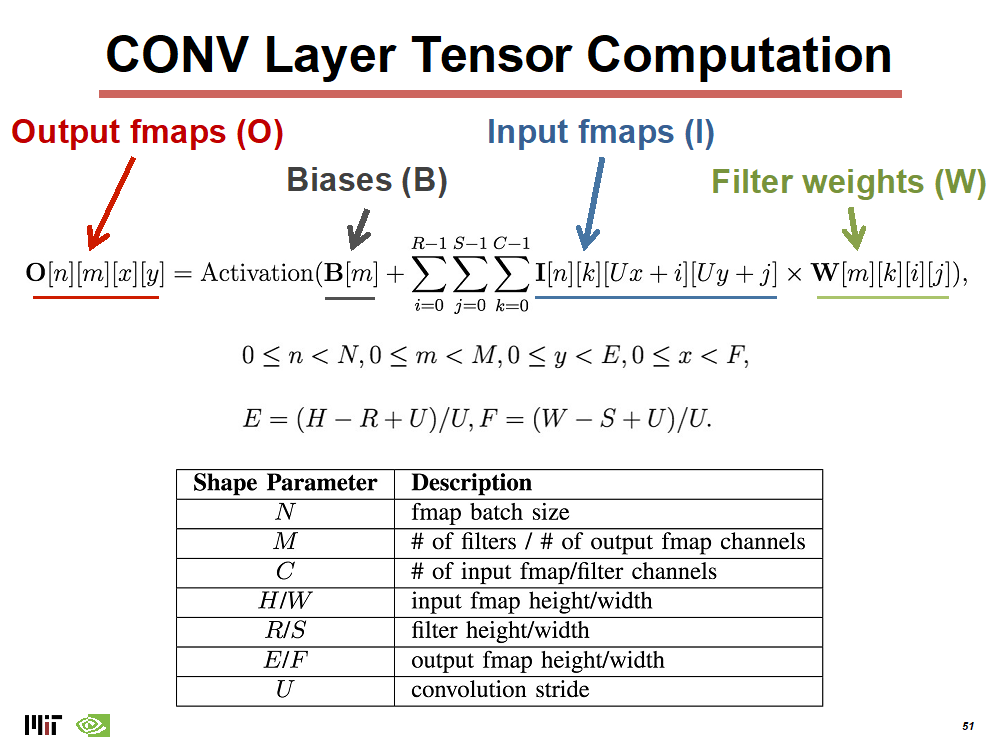
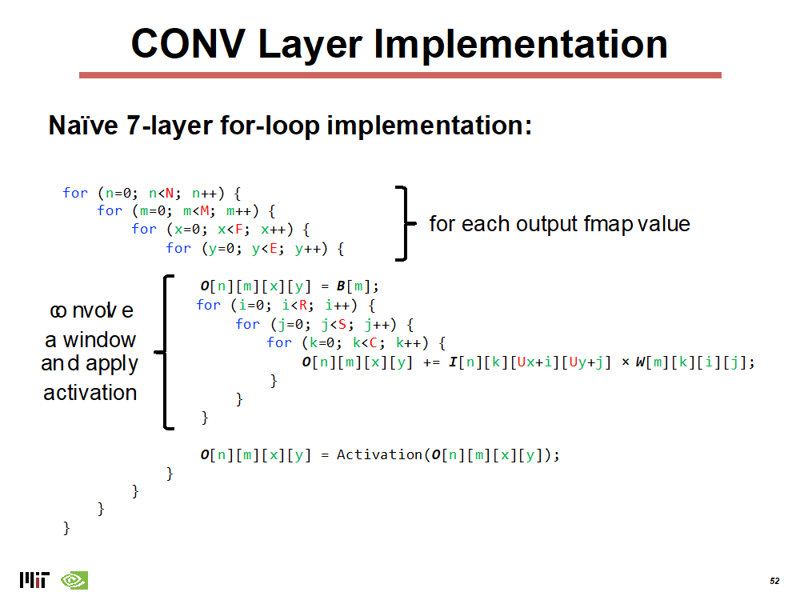
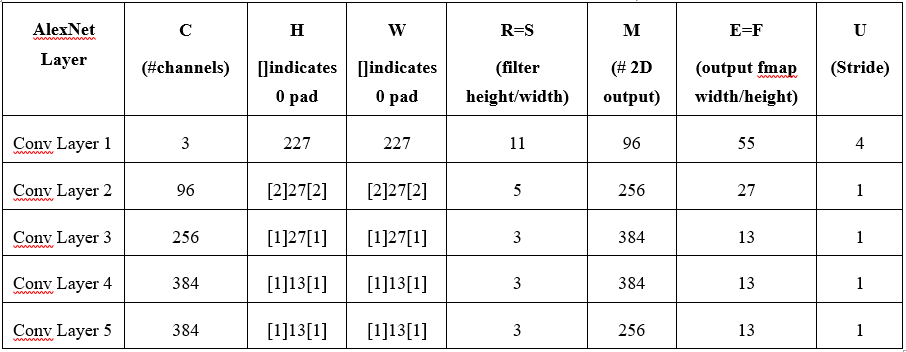

# ECE 695 CUDA Programming Part 3

## Professor Tim Rogers <br> TA: Abhishek Bhaumick

## Due on March 20, 2021


# Introduction


In this assignment we will implement the computing kernel that
consumes the most cycles in real GPUs today: those associated with Convolutional
Neural Networks (CNNs). We will cover the details of CNNs later in the class,
however we will introduce the core algorithm you are to implement in CUDA here.
We will also cover in class (in Section 4) how convolutions can be transformed
into matrix multiply operations - which are also used to implement what are
known as "fully connected" layers in neural networks.
In Part B of this assignment, you are to implement matrix multiply in
CUDA with a few tweaks. With the three core kernels implemented in parts 2 and 3
you have implemented the major components of Deep Neural Networks on GPUs.

# Part A: Convolutional Neural Networks

The CNN problem is an embarrassing parallel one, which could be parallelized in
several possible ways. Exactly how you parallelize the problem is left up to
you. In this assignment you will create the code to run the convolution kernels
in the GPU, CPU implementations are provided for you.


CNN layers have a variety of parameters that determine the compute of the
workload and the dimensionality of both the input and output. Very simply, a 2D
convolution (which is what we are implementing here) slides a group of weights
across an input (called activations), multiplying each weight by its
corresponding input value and aggregates that multiplication into a
multi-dimensional output.

The names for the parameters here:
<span style="display:block;text-align:center">\
    
</span>

<br>

And the math for the convolution is here:
<span style="display:block;text-align:center">\
    
</span>


This translates into the relatively simple code below. Note that the ordering
of the loops is highly flexible and we leave it to you determine what loop-order
works best.
<span style="display:block;text-align:center">\
    
</span>

The inputs that you should use to evaluate the convolution are those from the
original AlexNet paper.
<span style="display:block;text-align:center">\
    
</span>

The structure of the original AlexNet networks, composed of CNN layers, pooling
layers and fully connected layers is shown here:
<span style="display:block;text-align:center">\
    
</span>

The final 3 layers are fully-connected, which can be implemented with matrix
multiply. Note that the blocks indicate the input and output tensors and their
dimensions, while the arrows are the kernels that transform the tensors.

## What you are to hand in:

1. Your code that implements a convolution kernel in CUDA,
   optimized as much as you can.
1. Collect performance results using the 5 convolution layer matrix sizes use
   the same reporting format as lab 2.
1. Create a report that includes these figures and details any optimizations you
   did to improve your code's performance.


# Part B: General Matrix Multiply (GEMM)

In this section you are to implement a kernel that performs general matrix
multiplication. Code for GEMMs have been covered extensively in class and you
are free to use any of the slide implementations as a starting point. You should
attempt to optimize the code and detail your optimizations in the report.
In addition, you should implement the GEMM using both CUDA memory copies and unified
virtual memory and compare the performance.

For the input size, use the fully-connected layer size from 2nd fully connected
of AlexNet (pictured above) and sweep the batch size from 1 to 3.
Note that for this layer, you will have an input matrix that is 
(BatchSize x 4096), which is multiplied by a (4096x4096) weight matrix.


## What you are to hand in:

1. Your matrix multiply code, optimized as much as you can.
1. Performance results for the 3 matrix multiply sizes - in the same format as
   in part A.
1. Create a report that includes these figures and details any optimizations you
   did to improve your code's performance.

**Note: You do not have to connect everything to complete this assignment. The
primary outcome of the assignment is just a convolution implementation and a
GEMM implementation evaluated with different sizes.**

> ### NOTE:
>
> The TensorDim struct has been modified to add a element for the 4th dimension (shown below).
> 
> This should `NOT` affect any of your existing code unless you have used dynamic allocation for creating TensorShape objects and (incorrectly) `NOT` used `sizeof(TensorShape)`

```C++
	typedef struct TensorShape_t {
		uint32_t width;		//	Width = # cols	-	1st dimension
		uint32_t height;	//	Height = # rows	-	2nd dimension
		uint32_t channels;	//	3rd dimension
		uint32_t count;		//	4th dimension	-	Quite unimaginative .. I know
	} TensorShape;
```
> ### NOTE:
>
> When profiling your kernels, you can use the CONV_CHECK_DISABLE flag to avoid checking the verifying the GPU results against a CPU run. 
> This will avoid calling the CPU function as well as running a element-wise check.

# References

<a id="1">[1]</a>
Alex Krizhevsky, Ilya Sutskever, and Geoffrey E. Hinton. 2012. ImageNet classification with deep con-volutional neural networks. In Proceedings of the 25th International Conference on Neural Information Processing Systems - Volume 1 (NIPS’12). Curran Associates Inc., Red Hook, NY, USA, 1097–1105.
