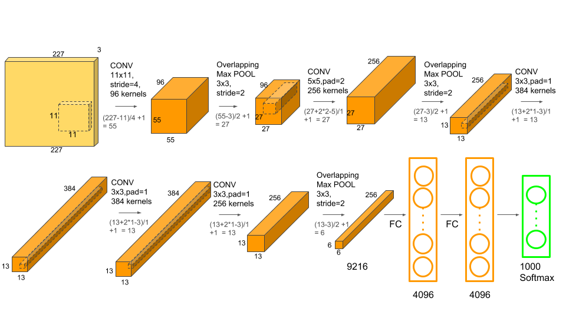

# ECE 695 CUDA Programming Part 4 (Bonus)

## Professor Tim Rogers   TA: Abhishek Bhaumick

## Due on May 8, 2021

# Introduction

The directions for this part are simple: take the computations kernels you
created in the first 3 labs and use them to create AlexNet from them.
To remind you, the architecture of AlexNet[[1]] is as follows.
\
    

Try to optimize the full AlexNet flow as much as possible - validating it on the
CPU will be very difficult given how long it will take on the CPU. So simply
measure the full AlexNet execution time at different batch sizes and report.

Completing this will give you serious street credit, you can now claim you
implemented AlexNet from scratch using CUDA :)

# References

<a id="1">[1]</a>
Alex Krizhevsky, Ilya Sutskever, and Geoffrey E. Hinton. 2012. ImageNet classification with deep con-volutional neural networks. In Proceedings of the 25th International Conference on Neural Information Processing Systems - Volume 1 (NIPS’12). Curran Associates Inc., Red Hook, NY, USA, 1097–1105.
